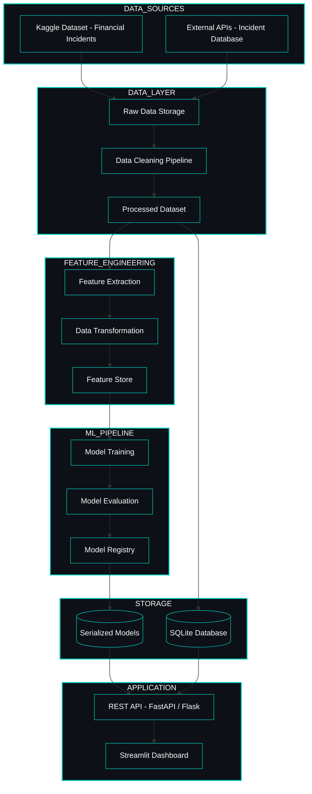

<!-- ======================================= ⚡️ Start DEFAULT HEADER ===========================================  -->

<!-- ========= START LANGUAGE BUTTON ========= -->
 

**\[[🇧🇷 Português](README.pt_BR.md)\] \[**[🇬🇧 English](README.md)**\]**

  
<!-- ========= END LANGUAGE BUTTON ========= -->

<!-- ========= START REPO TITLE ========= -->
# 
 🔐 [Cybersecurity, Social Engineering and AI Security]()  / [Project 4 – AI Finance Incident Risk & Governance Analysis ]() 
### 
 Analysis of Algorithmic Bias • Operational Risk • AI Governance Responses in Financial Services 

  
<!-- ========= END REPO TITLE ========= -->

<!-- ========= START Institucional INFO ========= -->
## [Cybersecurity and Social Engineering Integrated Project - PUC-SP 5th Semester (2026)]()

 

[**Institution:**]() Pontifical Catholic University of São Paulo (PUC‑SP – Humanistic AI & Data Science • 5º Semester • 2026)   
[**School:**]() FACEI – Faculty of Interdisciplinary Studies   
[**Course Repo:**]() INTEGRATED PROJECT: Cybersecurity and Social Engineering – 108 Hours   
**Professor:** [✨ Eduardo Savino Gomes]()   
[**Extensionist Activities:**]() Extension projects and workshops using open‑source software and data‑driven consulting to support the community, aligned with the 20 official extension hours of the course.

  

#

  
<!-- ========= END Institucional INFO ========= -->

<!-- ========= START BADGES ========= -->

  
  
  
  
  

  

#

  
<!-- ========= END START BADGES ========= -->

<!-- ========= START Confidentiality statement ========= -->

> [!IMPORTANT]
> 
> ⚠️ Heads Up
>
> * Projects and deliverables may be made [publicly available]() whenever possible.
>   
> * The course emphasizes [**practical, hands-on experience**]() with real datasets to simulate professional consulting scenarios in the fields of **Machine Learning and Neural Networks** for partner organizations and institutions affiliated with the university.
>   
> * All activities comply with the [**academic and ethical guidelines of PUC-SP**]().
>   
> * Any content not authorized for public disclosure will remain [**confidential**]() and securely stored in [private repositories]().  
>  
>
>

   

#

  
<!-- ========= END Confidentiality statement  ========= -->

<!-- ========= START Main Repo REFERENCE  ========= -->
> [!TIP]
>
> This repository is part of the flagship project:
> **🔐 Cybersecurity, Social Engineering & AI Security — Main Hub**
>
> Explore the complete ecosystem of materials, analyses, and notebooks in the central repository:
>
> * 🔗 **[Cybersecurity, Social Engineering & AI Security — Main Hub Repository](https://github.com/Quantum-Software-Development/1-Cybersecurity-SocialEngineering_Main_Hub_Repository-PUCSP)**
>
> *Part of the Humanistic AI Data Modeling Series — where data connects with human insight… and occasionally gets socially engineered. ⚡️

    
<!-- ========= END Main Repo REFERENCE  ========= -->

<!-- ======================================= END DEFAULT HEADER ⚡️ ===========================================  -->

## Table of Contents

1. [Project Overview](#project-overview)  
   1.1 [Business Context](#business-context)  
   1.2 [General Objective](#general-objective)  
   1.3 [Specific Objectives](#specific-objectives)  
   1.4 [Research Questions](#research-questions)

2. [Data and Problem Definition](#data-and-problem-definition)  
   2.1 [Source Data: AI Incident Database (AIID)](#source-data-ai-incident-database-aiid)  
   2.2 [Scope: Financial Services Subset](#scope-financial-services-subset)  
   2.3 [Key Raw Variables](#key-raw-variables)  
   2.4 [Core Analytical Concepts and Definitions](#core-analytical-concepts-and-definitions)

3. [Derived Variables and Data Model](#derived-variables-and-data-model)  
   3.1 [Financial Application Type](#financial-application-type)  
   3.2 [Customer Segment](#customer-segment)  
   3.3 [Incident Type](#incident-type)  
   3.4 [Severity and Financial Loss](#severity-and-financial-loss)  
   3.5 [Governance and Regulatory Response](#governance-and-regulatory-response)  
   3.6 [Temporal and Geographic Dimensions](#temporal-and-geographic-dimensions)  
   3.7 [Relational Data Model (SQLite)](#relational-data-model-sqlite)

4. [Exploratory Analysis and Statistical Hypotheses](#exploratory-analysis-and-statistical-hypotheses)  
   4.1 [Descriptive Questions](#descriptive-questions)  
   4.2 [Hypothesis 1 – Concentration by Application Type](#hypothesis-1--concentration-by-application-type)  
   4.3 [Hypothesis 2 – Bias by Customer Segment](#hypothesis-2--bias-by-customer-segment)  
   4.4 [Hypothesis 3 – Severity and Regulatory Response](#hypothesis-3--severity-and-regulatory-response)  
   4.5 [Hypothesis 4 – Temporal Trends and Regulation](#hypothesis-4--temporal-trends-and-regulation)

5. [Machine Learning and Statistical Techniques](#machine-learning-and-statistical-techniques)  
   5.1 [Predictive Models](#predictive-models)  
   5.2 [Text Mining and NLP](#text-mining-and-nlp)  
   5.3 [Statistical Methods](#statistical-methods)  
   5.4 [Visual Analytics](#visual-analytics)

6. [Project Structure and Notebooks](#project-structure-and-notebooks)  
   6.1 [Phase 1 – Exploratory & Data Preparation](#phase-1--exploratory--data-preparation)  
   6.2 [Phase 2 – Statistical Analysis & Hypothesis Testing](#phase-2--statistical-analysis--hypothesis-testing)  
   6.3 [Phase 3 – Predictive Modeling & REST API](#phase-3--predictive-modeling--rest-api)  
   6.4 [Final Consolidated Pipeline Notebook](#final-consolidated-pipeline-notebook)

7. [CRISP‑DM Methodology Alignment](#crisp-dm-methodology-alignment)  
   7.0 [CRISP‑DM Methodology Diagram](#crisp‑dm-methodology-diagram)  
   7.1 [Business Understanding](#business-understanding)  
   7.2 [Data Understanding](#data-understanding)  
   7.3 [Data Preparation](#data-preparation)  
   7.4 [Modeling](#modeling)  
   7.5 [Evaluation](#evaluation)  
   7.6 [Deployment](#deployment)

9. [How to Run](#how-to-run)  
   8.1 [Repository and Environment](#repository-and-environment)  
   8.2 [Notebook Execution Order](#notebook-execution-order)  
   8.3 [Starting the API](#starting-the-api)

10. [Dataset Access](#dataset-access)  

11. [Author](#author)  

12. [Topics](#topics)  

13. [Final Note](#final-note)

  

## 1. [Project Overview]()

### [1.1]()- ***Business Context***

The financial sector has rapidly adopted AI systems across areas such as credit scoring, fraud detection, algorithmic trading, customer service, and process automation. While these technologies generate significant value, they also introduce new forms of operational risk, algorithmic bias, and regulatory exposure, including fines, investigations, and reputational damage. In this context, this project analyzes documented incidents involving Artificial Intelligence (AI) in financial services, with a focus on algorithmic bias, operational risk, and governance responses in banks and fintechs. 

The analysis relies on data from the AI Incident Database (AIID), accessed via Kaggle or the official platform (https://incidentdatabase.ai), and follows the CRISP-DM methodology, combining structured data analysis, statistical techniques, and simple predictive models to generate insights that support risk management and AI governance in the financial sector.

In addition, the project adopts the perspective of a boutique consulting firm specialized in AI risk in financial services, working alongside banks and fintechs to identify patterns of AI-related incidents, map systemic vulnerabilities, and prevent future occurrences, with a strong emphasis on protecting customers from algorithmic bias, operational failures, and potentially harmful automated financial decisions, while aligning technical work with principles of transparency, robustness, fairness, and human-centered decision-making in regulated environments.

  

# AI Financial Incident Intelligence System  
## System Architecture (MLOps Design)

 

  

  
  
  
  
  
  

<!-- ======================================= Start DEFAULT Footer ===========================================  -->
  

## 💌 [Let the data flow... Ping Me !](mailto:fabicampanari@proton.me)

 

#### 
  🛸๋ My Contacts [Hub](https://linktr.ee/fabianacampanari)

 

### 
 

  

  ────────────── ⊹🔭๋ ──────────────

<!--

  ────────────── 🛸๋*ੈ✩* 🔭*ੈ₊ ──────────────
-->

 

 ➣➢➤ <a href="#top">Back to Top </a>
  

  
#
 
##### 
 Copyright 2026 Quantum Software Development. Code released under the  [MIT license.](https://github.com/Mindful-AI-Assistants/CDIA-Entrepreneurship-Soft-Skills-PUC-SP/blob/21961c2693169d461c6e05900e3d25e28a292297/LICENSE)

