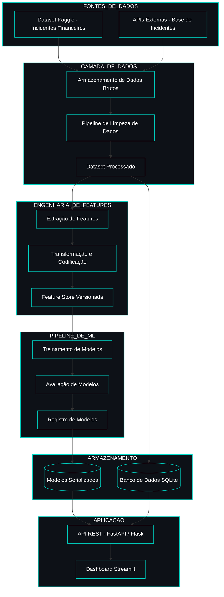

<!-- ======================================= ⚡️ Start DEFAULT HEADER ===========================================  -->

<!-- ========= START LANGUAGE BUTTON ========= -->
 

**\[[🇧🇷 Português](README.pt_BR.md)\] \[**[🇬🇧 English](README.md)**\]**

  
<!-- ========= END LANGUAGE BUTTON ========= -->

<!-- ========= START REPO TITLE ========= -->
# 
 🔐 [Cybersecurity, Social Engineering and AI Security]()  / [Project 4 – AAI Incidents in Financial Services ]() 
### 
 Análise de Viés Algorítmico, Risco Operacional e Governança de IA em Serviços Financeiros

  
<!-- ========= END REPO TITLE ========= -->

<!-- ========= START Institucional INFO ========= -->
## [Cybersecurity and Social Engineering Integrated Project - PUC-SP 5th Semester (2026)]()

 

[**Institution:**]() Pontifical Catholic University of São Paulo (PUC‑SP – Humanistic AI & Data Science • 5º Semester • 2026)   
[**School:**]() FACEI – Faculty of Interdisciplinary Studies   
[**Course Repo:**]() INTEGRATED PROJECT: Cybersecurity and Social Engineering – 108 Hours   
**Professor:** [✨ Eduardo Savino Gomes]()   
[**Extensionist Activities:**]() Extension projects and workshops using open‑source software and data‑driven consulting to support the community, aligned with the 20 official extension hours of the course.

  

#

  
<!-- ========= END Institucional INFO ========= -->

<!-- ========= START BADGES ========= -->

  
  
  
  
  

  

#

  
<!-- ========= END START BADGES ========= -->

<!-- ========= START Confidentiality statement ========= -->

> [!IMPORTANT]
> 
> ⚠️ Heads Up
>
> * Projects and deliverables may be made [publicly available]() whenever possible.
>   
> * The course emphasizes [**practical, hands-on experience**]() with real datasets to simulate professional consulting scenarios in the fields of **Machine Learning and Neural Networks** for partner organizations and institutions affiliated with the university.
>   
> * All activities comply with the [**academic and ethical guidelines of PUC-SP**]().
>   
> * Any content not authorized for public disclosure will remain [**confidential**]() and securely stored in [private repositories]().  
>  
>
>

   

#

  
<!-- ========= END Confidentiality statement  ========= -->

<!-- ========= START Main Repo REFERENCE  ========= -->
> [!TIP]
>
> This repository is part of the flagship project:
> **🔐 Cybersecurity, Social Engineering & AI Security — Main Hub**
>
> Explore the complete ecosystem of materials, analyses, and notebooks in the central repository:
>
> * 🔗 **[Cybersecurity, Social Engineering & AI Security — Main Hub Repository](https://github.com/Quantum-Software-Development/1-Cybersecurity-SocialEngineering_Main_Hub_Repository-PUCSP)**
>
> *Part of the Humanistic AI Data Modeling Series — where data connects with human insight… and occasionally gets socially engineered. ⚡️

    
<!-- ========= END Main Repo REFERENCE  ========= -->

<!-- ======================================= END DEFAULT HEADER ⚡️ ===========================================  -->

  

## Table of Contents

 1. [Introdução](#1-introdução)
2. [Objetivos e Questões de Pesquisa](#2-objetivos-e-questões-de-pesquisa)
3. [Fundamentação e Contexto de Dados](#3-fundamentação-e-contexto-de-dados)
4. [Metodologia — CRISP-DM](#4-metodologia--crisp-dm)
5. [Dados Utilizados e Preparação](#5-dados-utilizados-e-preparação)
6. [Variáveis Analíticas e Hipóteses](#6-variáveis-analíticas-e-hipóteses)
7. [Técnicas Estatísticas e de IA/ML](#7-técnicas-estatísticas-e-de-iaml)
8. [Estrutura Técnica — 5 Notebooks](#8-estrutura-técnica--5-notebooks)
9. [Banco de Dados Relacional e API RESTful](#9-banco-de-dados-relacional-e-api-restful)
10. [Resultados Obtidos](#10-resultados-obtidos)
11. [Cronograma, Entregáveis e Alinhamento ao Briefing](#11-cronograma-entregáveis-e-alinhamento-ao-briefing)
12. [Guia de Instalação e Execução](#12-guia-de-instalação-e-execução)
13. [Estrutura de Arquivos do Projeto](#13-estrutura-de-arquivos-do-projeto)
14. [Limitações, Riscos e Cuidados Metodológicos](#14-limitações-riscos-e-cuidados-metodológicos)
15. [Considerações Finais e Próximos Passos](#15-considerações-finais-e-próximos-passos)
16. [Referências](#16-referências)

  

## 1. [Introdução]()

 

### [1.1]() ***Contextualização do tema***

O uso de sistemas de Inteligência Artificial (IA) no setor financeiro cresceu de forma acelerada em aplicações como concessão de crédito, detecção de fraude, *trading* algorítmico, avaliação de risco e automação de atendimento. Esse avanço cria oportunidades de eficiência e inovação, mas também amplia superfícies de **risco operacional**, **viés algorítmico** e **falhas de governança** em ambientes altamente regulados.

Este projeto parte de incidentes reais de IA documentados em diferentes organizações para construir uma visão estruturada de como esses riscos se manifestam em serviços financeiros, com foco em **viés algorítmico**, **risco operacional** e **respostas de governança** em bancos e fintechs.

 

### [1.2]() ***Problema de pesquisa***

Dado um conjunto de incidentes de IA registrados em múltiplos setores e filtrados para o domínio financeiro, o problema central é avaliar se:

- existem **padrões sistemáticos** de viés e risco associados a certos tipos de aplicação de IA (crédito, fraude, *trading*);
- determinados **segmentos de clientes** são desproporcionalmente afetados;
- **respostas de governança** e de reguladores acompanham adequadamente a gravidade dos incidentes.

 

### [1.3]() ***Relevância para o setor financeiro e para a governança de IA***

 

| [Stakeholder]() | [Benefício Direto]() |
|---|---|
| [**Bancos e Fintechs**]() | Aprimorar gestão de risco operacional e reputacional |
| [**Reguladores**]() | Supervisão baseada em dados e evidências quantitativas |
| [**Gestores de Risco**]() | Ferramentas para avaliar exposição a incidentes de IA |
| [**Compliance**]() | Identificar lacunas regulatórias e priorizar auditorias |
| [**Investidores**]() | Entender impacto de incidentes de IA no valor de instituições |

  

> [!TIP]
>
> Para a [**governança de IA**](), o projeto ilustra como dados de incidentes podem ser transformados em indicadores, modelos preditivos e APIs, viabilizando monitoramento contínuo e respostas estruturadas a riscos.
>
>  

  

# Sistema de Inteligência de Incidentes Financeiros com IA  
## Arquitetura do Sistema (Design MLOps)

 

  
  
  
  
  
  

<!-- ======================================= Start DEFAULT Footer ===========================================  -->
  

## 💌 [Let the data flow... Ping Me !](mailto:fabicampanari@proton.me)

 

#### 
  🛸๋ My Contacts [Hub](https://linktr.ee/fabianacampanari)

 

### 
 

  

  ────────────── ⊹🔭๋ ──────────────

<!--

  ────────────── 🛸๋*ੈ✩* 🔭*ੈ₊ ──────────────
-->

 

 ➣➢➤ <a href="#top">Back to Top </a>
  

  
#
 
##### 
 Copyright 2026 Quantum Software Development. Code released under the  [MIT license.](https://github.com/Mindful-AI-Assistants/CDIA-Entrepreneurship-Soft-Skills-PUC-SP/blob/21961c2693169d461c6e05900e3d25e28a292297/LICENSE)

